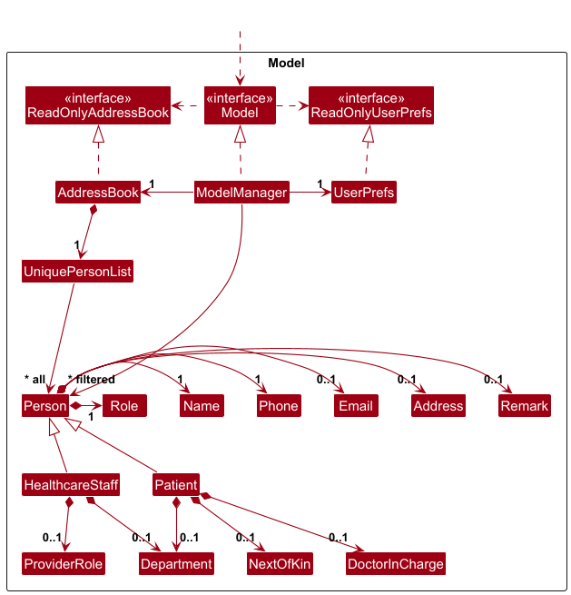

* Table of Contents
{:toc}

--------------------------------------------------------------------------------------------------------------------

## **Acknowledgements**

* This project is adapted based on [AB-3](https://github.com/nus-cs2103-AY2425S2/tp), an address book GUI desktop application created by [SE_EDU](https://se-education.org/).

--------------------------------------------------------------------------------------------------------------------

## **Setting up, getting started**

Refer to the guide [_Setting up and getting started_](SettingUp.md).

--------------------------------------------------------------------------------------------------------------------

## **Design**

:bulb: **Tip:** The `.puml` files used to create diagrams in this document `docs/diagrams` folder. Refer to the [_PlantUML Tutorial_ at se-edu/guides](https://se-education.org/guides/tutorials/plantUml.html) to learn how to create and edit diagrams.

### Architecture

The ***Architecture Diagram*** given above explains the high-level design of the App.

Given below is a quick overview of main components and how they interact with each other.

**Main components of the architecture**

**`Main`** (consisting of classes [`Main`](https://github.com/AY2425S2-CS2103T-T12-2/tp/tree/master/src/main/java/seedu/address/Main.java) and [`MainApp`](https://github.com/AY2425S2-CS2103T-T12-2/tp/tree/master/src/main/java/seedu/address/MainApp.java)) is in charge of the app launch and shut down.
* At app launch, it initializes the other components in the correct sequence, and connects them up with each other.
* At shut down, it shuts down the other components and invokes cleanup methods where necessary.

The bulk of the app's work is done by the following four components:

* [**`UI`**](#ui-component): The UI of the App.
* [**`Logic`**](#logic-component): The command executor.
* [**`Model`**](#model-component): Holds the data of the App in memory.
* [**`Storage`**](#storage-component): Reads data from, and writes data to, the hard disk.

[**`Commons`**](#common-classes) represents a collection of classes used by multiple other components.

**How the architecture components interact with each other**

The *Sequence Diagram* below shows how the components interact with each other for the scenario where the user issues the command `delete 1`.

Each of the four main components (also shown in the diagram above),

* defines its *API* in an `interface` with the same name as the Component.
* implements its functionality using a concrete `{Component Name}Manager` class (which follows the corresponding API `interface` mentioned in the previous point.

For example, the `Logic` component defines its API in the `Logic.java` interface and implements its functionality using the `LogicManager.java` class which follows the `Logic` interface. Other components interact with a given component through its interface rather than the concrete class (reason: to prevent outside component's being coupled to the implementation of a component), as illustrated in the (partial) class diagram below.

The sections below give more details of each component.

### UI component

The **API** of this component is specified in [`Ui.java`](https://github.com/AY2425S2-CS2103T-T12-2/tp/tree/master/src/main/java/seedu/address/ui/Ui.java)

The UI consists of a `MainWindow` that is made up of parts e.g.`CommandBox`, `ResultDisplay`, `ContentPanel`, `PersonListPanel`, `StatusBarFooter`, and `HelpWindow`. 
The `HelpWindow` functions as a separate window that provides additional support to the user.
All these component, including the `MainWindow` and `HelpWindow`, inherit from the abstract `UiPart` class which captures the commonalities between classes that represent parts of the visible GUI.

The `UI` component uses the JavaFx UI framework. The layout of these UI parts are defined in matching `.fxml` files that are in the `src/main/resources/view` folder. For example, the layout of the [`MainWindow`](https://github.com/AY2425S2-CS2103T-T12-2/tp/tree/master/src/main/java/seedu/address/ui/MainWindow.java) is specified in [`MainWindow.fxml`](https://github.com/AY2425S2-CS2103T-T12-2/tp/tree/master/src/main/resources/view/MainWindow.fxml)

The `UI` component,

* executes user commands using the `Logic` component.
* listens for changes to `Model` data so that the UI can be updated with the modified data.
* keeps a reference to the `Logic` component, because the `UI` relies on the `Logic` to execute commands.
* depends on some classes in the `Model` component, as it displays `Person` object residing in the `Model`.

### Logic component

**API** : [`Logic.java`](https://github.com/AY2425S2-CS2103T-T12-2/tp/tree/master/src/main/java/seedu/address/logic/Logic.java)

Here's a (partial) class diagram of the `Logic` component:

The sequence diagram below illustrates the interactions within the `Logic` component, taking `execute("delete 1")` API call as an example.

:information_source: **Note:** The lifeline for `DeleteCommandParser` should end at the destroy marker (X) but due to a limitation of PlantUML, the lifeline continues till the end of diagram.

How the `Logic` component works:

1. When `Logic` is called upon to execute a command, it is passed to an `AddressBookParser` object which in turn creates a parser that matches the command (e.g., `DeleteCommandParser`) and uses it to parse the command.
2. This results in a `Command` object (more precisely, an object of one of its subclasses e.g., `DeleteCommand`) which is executed by the `LogicManager`.
3. The command can communicate with the `Model` when it is executed (e.g. to delete a person). 
   Note that although this is shown as a single step in the diagram above (for simplicity), in the code it can take several interactions (between the command object and the `Model`) to achieve.
4. The result of the command execution is encapsulated as a `CommandResult` object which is returned back from `Logic`.

Here are the other classes in `Logic` (omitted from the class diagram above) that are used for parsing a user command:

How the parsing works:
* When called upon to parse a user command, the `AddressBookParser` class creates an `XYZCommandParser` (`XYZ` is a placeholder for the specific command name e.g., `AddCommandParser`) which uses the other classes shown above to parse the user command and create a `XYZCommand` object (e.g., `AddCommand`) which the `AddressBookParser` returns back as a `Command` object.
* All `XYZCommandParser` classes (e.g., `AddCommandParser`, `DeleteCommandParser`, `FindByNameCommandParser`...) inherit from the `Parser` interface so that they can be treated similarly where possible e.g, during testing.

### Model component
**API** : [`Model.java`](https://github.com/AY2425S2-CS2103T-T12-2/tp/tree/master/src/main/java/seedu/address/model/Model.java)

The `Model` component,

* stores the address book data i.e., all `Person` objects (which are contained in a `UniquePersonList` object).
* stores the currently 'selected' `Person` objects (e.g., results of a search query) as a separate _filtered_ list which is exposed to outsiders as an unmodifiable `ObservableList<Person>` that can be 'observed' e.g. the UI can be bound to this list so that the UI automatically updates when the data in the list change.
* stores a `UserPref` object that represents the user’s preferences. This is exposed to the outside as a `ReadOnlyUserPref` objects.
* does not depend on any of the other three components (as the `Model` represents data entities of the domain, they should make sense on their own without depending on other components)

### Storage component

**API** : [`Storage.java`](https://github.com/AY2425S2-CS2103T-T12-2/tp/tree/master/src/main/java/seedu/address/storage/Storage.java)

The `Storage` component,
* can save both address book data and user preference data in JSON format, and read them back into corresponding objects.
* inherits from both `AddressBookStorage` and `UserPrefStorage`, which means it can be treated as either one (if only the functionality of only one is needed).
* depends on some classes in the `Model` component (because the `Storage` component's job is to save/retrieve objects that belong to the `Model`)

### Common classes

Classes used by multiple components are in the `seedu.address.commons` package.

--------------------------------------------------------------------------------------------------------------------

## **Implementation**

This section describes some noteworthy details on how certain features are implemented.

### Add patient feature

#### Implementation

The image below shows the class diagram of a Patient object and its related class attributes.

The Patient object is made up of several attributes:
* `Name`: The name of the patient.
* `Phone`: The phone number of the patient.
* `Email`: The email of the patient.
* `Address`: The address of the patient.
* `Doctor in charge`: The primary doctor assigned to the patient.
* `Next of kin`: The next of kin information of the patient.

The Next of kin Contact object is also made up of attributes:
* `Name`: The name of the next of kin.
* `Phone`: The phone number of the next of kin.

#### Feature details

1. ACaringBook will verify that the parameters supplied by the user follow a set of relevant restrictions for the respective parameters.
2. If any invalid parameter is provided, an error will be thrown, informing the user which parameter violates the restrictions. The format for the valid input for that parameter will be displayed to the user.
3. If all parameters are valid, a new `Patient` entry will be created and stored in the `ACaringBook`.

#### Design Considerations:

**Aspect: The required input of parameters:**

* **Alternative 1:** Make all parameters compulsory.
    * Pros: Will not have missing data when it is needed in an emergency.
    * Cons: Addpatient Command is lengthy to type out, might be hard to remember the syntax.
* **Alternative 2 (current choice):** Make only a few specific parameters compulsory (i.e. Name and Phone).
    * Pros: Patient registration will be faster.
    * Cons: If user forgets to update missing details, during an emergency there might not be an emergency contact to call.

We opted for Alternative 2 as some information may not be available during emergency visit. Making some parameters optional also makes Addpatient Command fast.

--------------------------------------------------------------------------------------------------------------------

### \[Proposed\] Undo/redo feature

#### Proposed Implementation

The proposed undo/redo mechanism is facilitated by `VersionedAddressBook`. It extends `AddressBook` with an undo/redo history, stored internally as an `addressBookStateList` and `currentStatePointer`. Additionally, it implements the following operations:

* `VersionedAddressBook#commit()` — Saves the current address book state in its history.
* `VersionedAddressBook#undo()` — Restores the previous address book state from its history.
* `VersionedAddressBook#redo()` — Restores a previously undone address book state from its history.

These operations are exposed in the `Model` interface as `Model#commitAddressBook()`, `Model#undoAddressBook()` and `Model#redoAddressBook()` respectively.

Given below is an example usage scenario and how the undo/redo mechanism behaves at each step.

Step 1. The user launches the application for the first time. The `VersionedAddressBook` will be initialized with the initial address book state, and the `currentStatePointer` pointing to that single address book state.

Step 2. The user executes `delete 5` command to delete the 5th person in the address book. The `delete` command calls `Model#commitAddressBook()`, causing the modified state of the address book after the `delete 5` command executes to be saved in the `addressBookStateList`, and the `currentStatePointer` is shifted to the newly inserted address book state.

Step 3. The user executes `add n/David …​` to add a new person. The `add` command also calls `Model#commitAddressBook()`, causing another modified address book state to be saved into the `addressBookStateList`.

:information_source: **Note:** If a command fails its execution, it will not call `Model#commitAddressBook()`, so the address book state will not be saved into the `addressBookStateList`.

Step 4. The user now decides that adding the person was a mistake, and decides to undo that action by executing the `undo` command. The `undo` command will call `Model#undoAddressBook()`, which will shift the `currentStatePointer` once to the left, pointing it to the previous address book state, and restores the address book to that state.

:information_source: **Note:** If the `currentStatePointer` is at index 0, pointing to the initial AddressBook state, then there are no previous AddressBook states to restore. The `undo` command uses `Model#canUndoAddressBook()` to check if this is the case. If so, it will return an error to the user rather
than attempting to perform the undo.

The following sequence diagram shows how an undo operation goes through the `Logic` component:

:information_source: **Note:** The lifeline for `UndoCommand` should end at the destroy marker (X) but due to a limitation of PlantUML, the lifeline reaches the end of diagram.

Similarly, how an undo operation goes through the `Model` component is shown below:

The `redo` command does the opposite — it calls `Model#redoAddressBook()`, which shifts the `currentStatePointer` once to the right, pointing to the previously undone state, and restores the address book to that state.

:information_source: **Note:** If the `currentStatePointer` is at index `addressBookStateList.size() - 1`, pointing to the latest address book state, then there are no undone AddressBook states to restore. The `redo` command uses `Model#canRedoAddressBook()` to check if this is the case. If so, it will return an error to the user rather than attempting to perform the redo.

Step 5. The user then decides to execute the command `list`. Commands that do not modify the address book, such as `list`, will usually not call `Model#commitAddressBook()`, `Model#undoAddressBook()` or `Model#redoAddressBook()`. Thus, the `addressBookStateList` remains unchanged.

Step 6. The user executes `clear`, which calls `Model#commitAddressBook()`. Since the `currentStatePointer` is not pointing at the end of the `addressBookStateList`, all address book states after the `currentStatePointer` will be purged. Reason: It no longer makes sense to redo the `add n/David …​` command. This is the behavior that most modern desktop applications follow.

The following activity diagram summarizes what happens when a user executes a new command:

#### Design considerations:

**Aspect: How undo & redo executes:**

* **Alternative 1 (current choice):** Saves the entire address book.
  * Pros: Easy to implement.
  * Cons: May have performance issues in terms of memory usage.

* **Alternative 2:** Individual command knows how to undo/redo by
  itself.
  * Pros: Will use less memory (e.g. for `delete`, just save the person being deleted).
  * Cons: We must ensure that the implementation of each individual command are correct.

--------------------------------------------------------------------------------------------------------------------

## **Documentation, logging, testing, configuration, dev-ops**

* [Documentation guide](Documentation.md)
* [Testing guide](Testing.md)
* [Logging guide](Logging.md)
* [Configuration guide](Configuration.md)
* [DevOps guide](DevOps.md)

--------------------------------------------------------------------------------------------------------------------

## **Appendix: Requirements**

### Product scope

**Target user profile**:

* Has a need to manage a significant number of contacts
* Prefers desktop apps over other types of applications
* Can type fast and prefers typing to mouse interactions
* Is comfortable using command-line interface (CLI) apps for efficiency

**Value proposition**: Our product streamlines patient coordination by providing instant access to patient details,
tagging patients to assigned doctors or caretakers, and tracking guardian or next-of-kin information.
It also keeps contact information for doctors, nurses, and staff up-to-date, ensuring faster communication,
improved workflows, and enhanced patient care.

### User stories

Priorities: High (must have) - `* * *`, Medium (nice to have) - `* *`, Low (unlikely to have) - `*`

| Priority | As a...                   | I want to...                                                        | So that I can...                                                                                                                                                          |
|----------|---------------------------|---------------------------------------------------------------------|---------------------------------------------------------------------------------------------------------------------------------------------------------------------------|
| ***      | Patient Care Coordinator  | add a new patient's contact information                             | easily store and access important patient details for future reference and communications                                                                                 |
| ***      | Patient Care Coordinator  | delete patient's contact information                                | remove obsolete patient data to keep the address book organized and clean                                                                                                 |
| ***      | Patient Care Coordinator  | view a list of patient contacts                                     | quickly manage and retrieve patient details without navigating multiple screens                                                                                           |
| ***      | Patient Care Coordinator  | see contact detail of a certain patient                             | look for important information such as next of kin information and contact number for quick outreach and coordination                                                                                    |
| ***      | Patient Care Coordinator  | add contact details for doctors, nurses, and other medical staff    | easily store and access important staff details for future reference and communications                                                                                   |
| ***      | Patient Care Coordinator  | delete contact details for doctors, nurses, and other medical staff | remove obsolete staff data to keep the address book organized and clean                                                                                                   |
| ***      | Patient Care Coordinator  | see contact details for doctors, nurses, and other medical staff    | have immediate access to accurate contact information for quick outreach and coordination                                                                                 |
| ***      | Patient Care Coordinator  | tag a patient to a primary doctor                                   | keep track of which medical professional is assigned to each patient for better organization and ensure that the right medical professional is notified for every patient |
| ***      | Patient Care Coordinator  | save contact details in a file locally                              | ensure patient details are preserved even after the application is closed                                                                                                 |
| ***      | Patient Care Coordinator  | load contact details from a local file                              | load patient details at startup, preventing the need to re-enter information                                                                                              |
| **       | Patient Care Coordinator  | search for a specific contact by name, role, etc.                   | quickly locate the right person or organization when urgent communication is needed                                                                                       |

### Use Cases

(For all use cases below, the System is the ACaringBook and the user is the Patient Care Coordinator, unless specified otherwise)

### Use case: Add a new patient/healthcare staff's contact information

**Main Success Scenario (MSS)**

1. User requests to add a new patient/staff’s contact information.
2. System validates the input details.
3. System stores the patient/staff’s details.
4. System confirms the successful addition.

**Use case ends.**

**Extensions**

- 2a. The input format is incorrect.
    - 2a1. System shows an error message.
    - 2a2. User re-enters the correct details.
    - Use case resumes at step 2.
- 3a. The patient/staff already exists in the System.
    - 3a1. System rejects the entry and displays an error message.
    - Use case ends.

---

### Use case: Delete a patient/staff’s contact information

**MSS**

1. User requests to list patients/healthcare staff.
2. System shows a list of patients/healthcare staff.
3. User requests to delete a specific patient/staff in the list via its index.
4. System deletes the patient/staff and confirms the deletion.

**Use case ends.**

**Extensions**

- 2a. The list is empty.
    - Use case ends.
- 3a. The given index is invalid.
    - 3a1. System shows an error message.
    - 3a2. User input a valid index.
    - Use case resumes at step 3.

---

### Use case: View list of patients/staffs

**MSS**

1. User requests to view a list of patients/staffs.
2. System displays all patients/staffs in a tabular format.

**Use case ends.**

---

### Use case: Find contacts by name

**MSS**

1. User requests to find a contact by name.
2. System validates the input.
3. System shows a list of contacts matches the name.

**Use case ends.**

---

### Use case: Find contacts by department

**MSS**

1. User requests to find contacts by department.
2. System validates the input.
3. System shows a list of contacts matches the department.

**Use case ends.**

---

### Use case: Find healthCare staff contacts by role

**MSS**

1. User requests to find healthcare staff contacts by role.
2. System validates the input.
3. System shows a list of contacts matches the department.

**Use case ends.**

---

### Use case: Add remark to a contact

**MSS**

1. User requests to add remark to a contact.
2. System validates the input.
3. System adds the remark to the contact and shows remark has been added successfully. 

**Extensions**

- 2a. The input remark is invalid.
    - 2a1. System shows an error message.
    - 2a2. User re-enters a valid remark.
    - Use case resumes at step 2.

**Use case ends.**

---

### Non-Functional Requirements

1.  Should work on any _mainstream OS_ as long as it has Java `17` or above installed.
2.  Should be able to hold up to 1000 contacts without a noticeable sluggishness in performance for typical usage.
3.  A user with above average typing speed for regular English text (i.e. not code, not system admin commands) should be able to accomplish most of the tasks faster using commands than using the mouse.
4.  Should only allow use by a single user (patient care coordinator).
5.  Should return search results within 0.5 seconds to ensure quick lookup.
6.  Should consume less than 200MB of RAM and low CPU usage on standard hardware.
7.  Data of the patients should be in a text file that is human editable.
8.  Should not require any installation by the user.
9.  Should be able to load data without internet connection.

### Glossary

* **Above average typing speed**: Typing speeds above the [global average](https://www.ratatype.com/learn/average-typing-speed/#:~:text=The%20average%20wpm%20speed%20is,successful%20in%20the%20working%20world.) of 41.4 words per minute.
* **Patient care coordinator**: A healthcare professional responsible for managing patient information and coordinating communication between medical staff and patients.
* **Contact**: An entry representing a patient, doctor, nurse or medical staff member within ACaringBook.
* **Patient**: A contact that is a patient must have phone and name field, other fields such as email, address, doctor in charge, NOK name and phone, department are optional.
* **Healthcare Staff**: Staff can be a Doctor, Nurse, Therapist, fields such as role, department, email and address are optional. A Staff must have a name and phone.
* **NOK (Next-of-Kin)**: Primary emergency contact for a patient, has a name and phone number. Having a NOK is not mandatory for every patient.

--------------------------------------------------------------------------------------------------------------------

## **Appendix: Instructions for manual testing**

Given below are instructions to test the app manually.

:information_source: **Note:** These instructions only provide a starting point for testers to work on;
testers are expected to do more *exploratory* testing.

## Launch and shutdown

### Initial launch

   1. Download the `.jar` file.
   2. Place it into an empty folder.
   3. Double-click the `.jar` file.

**Expected:**
- GUI launches with a set of **sample contacts**.
- **Window size may not be optimized** by default.

### Saving Window Preferences
1. Resize and reposition the application window.
2. Close the application.
3. Re-launch the app by double-clicking the `.jar` again.

**Expected:**
- App opens with the **last used window size and position** retained.

---
## Adding a patient (`addpatient`, `ap`)

### Valid Entry

**Command:**
`addpatient n/Jane Doe p/32345678 e/jane@example.com a/456 Serangoon Rd dr/Dr Tan nn/Mr Lim np/98765432 dp/Orthopedics`

**Expected:**
- Patient is added to the list.
- All details are displayed correctly.
- Success message in the status bar.

### Invalid Entry
**Command:**
`addpatient n/Jane Doe p/abcd`

**Expected:**
- Error message is displayed.
- No patient is added.

---

## Deleting a Person (`delete`, `del`, `d`)

### Valid Deletion

**Precondition:** Run `list` or `listpatient`. Ensure at least one contact exists.

**Command:**
`delete 1`

**Expected:**
- Contact at index 1 is deleted.
- Confirmation message shown.

### Invalid Deletion
**Command:**
`delete 0`

**Expected:**
- Error message is shown.
- No changes made to contact list.

---

## Editing a Contact (`edit`, `e`)

### Valid Edit

**Precondition:** At least two contacts exist.

**Command:**
`edit 2 n/John Tan p/87654321`

**Expected:**
- Contact at index 2 is updated.
- Confirmation message displayed.

### Invalid Edit
**Command:**
`edit two x/abc`

**Expected:**
- Error message shown.
- No changes made.

---

## Finding Entries

### Find by Name (`find`, `f`)

**Precondition:** A contact named "Jane" exists.

**Command:**
`find Jane`

**Expected:**
- All contacts with "Jane" in the name are listed.

### Find by Department (`finddep`, `fd`)

**Precondition:** A contact exists in the Surgery department.

**Command:**
`finddep Surgery`

**Expected:**
- All contacts under the "Surgery" department are shown.

### Find Staff by Role (`findstaff`, `fs`)

**Precondition:** A staff member with role "nurse" exists.

**Command:**
`findstaff nurse`

**Expected:**
- All staff with the role "nurse" are listed.

---

## Listing Commands
- `list` / `ls`: Lists all contacts
- `listpatient` / `lsp`: Lists only patients
- `liststaff` / `lss`: Lists only staff

**Expected:**
- Displays the correct subset of contacts.

---

## Adding Remarks (`remark`, `re`)

### Valid Remark

**Precondition:** At least once contact exists.

**Command:**
`remark 1 rm/Peanut allergy`

**Expected:**
- Remark is displayed under the contact.
- Status message confirms update.

### Invalid Remark
**Command:**
`remark 0 rm/Test`

**Expected:**
- Error message is shown.
- No updates made.

---

## Toggle Theme (`toggletheme`, `tt`)

**Command:**
`toggletheme`

**Expected:**
- Switches between **light** and **dark** themes.

---

## Clear All Contacts (`clear`, `cls`)

**Command:**
`clear`

**Expected:**
- All contacts are deleted.
- Status bar shows confirmation message.

---

## Help (`help`, `h`)

**Command:**
`help`

**Expected:**
- Opens the help window with a list of commands and usage formats.

---

## Exit (`exit`, `quit`)

**Command:**
`exit`

**Expected:**
- Application closes.
- All changes are saved.

---

## Saving and Loading Data

### Normal Save
1. Add or edit a contact.
2. Close the app using `exit`.
3. Relaunch the app.

**Expected:**
- Most recent data is shown.

---

### Missing or Corrupted Data Files

**How to Simulate:**
- Delete or rename the `data` folder or '.json' file.

**Expected:**
- Application detects issue.
- Loads with an **empty or sample dataset**.

--------------------------------------------------------------------------------------------------------------------

## **Appendix: Effort**
The ACaringBook project builds upon the base functionality of AddressBook-Level3 (AB3), but significantly expands its complexity by introducing multiple entity types and specialized features tailored to healthcare staff and streamlining their workflows.

**Increased Complexity Compared to AB3**  
While AB3 manages only one type of entity (`Person`), our application handles **two distinct subtypes**: `Patient` and `HealthcareStaff`. These subtypes have different attributes, behaviors, and validation rules. This includes department assignment, doctor-in-charge linkage, and healthcare provider roles. The addition of 2 additional subtypes required more effort in designing flexible model classes, command parsing logic, as well as UI display logic.

**Challenges Faced**  
* Implementing conditional fields and behaviors (e.g., guardian only applies to patients, provider roles only to staff).
* Modified the storage and loading mechanisms to correctly serialize and deserialize two different subtypes (Patient and HealthcareStaff), which required custom logic in JsonAdaptedPerson and careful handling of role-specific fields.
* Ensuring a smooth user experience via features like theme toggling, filtered list displays, and shortcut commands.

**Effort Highlights**  
* The development team spent considerable effort on the `addpatient`, `addstaff`, `edit`, and `find` command families to handle polymorphic behaviors cleanly.
* Particular care was taken in writing parsers that accept optional fields without crashing or misbehaving, while still rejecting invalid inputs.
* Storage and serialization (via JSON) had to be modified to support role-specific fields, which was non-trivial due to type casting and null handling.

**Reused Components**  
* We reused AB3’s core structure and base `Person` class. However, to support multiple roles and dynamic fields, we **refactored the model hierarchy** and introduced subclasses (`Patient`, `HealthcareStaff`).

**Estimated Effort**  
* Compared to AB3, we estimate an **additional 60–70% effort** was spent adapting the codebase to support subtype-based features.
* Around 10% of the project effort was saved through reuse of the existing AB3 storage and command infrastructure. For example, the JsonAdaptedPerson class from AB3 was extended rather than rewritten, allowing us to retain the existing JSON parsing logic for common Person fields while layering subtype-specific deserialization on top. Similarly, command structure and parser utilities (e.g., ParserUtil.java) were reused and adapted to handle multiple entity types without breaking the original structure.

--------------------------------------------------------------------------------------------------------------------
## **Appendix: Planned Enhancements**
Team size: 5

This appendix outlines potential future enhancements to improve the ACaringBook application. These ideas aim to add more value for users and developers, and serve as a starting point for future contributors.

### 1. Confirmation Prompt Before Deleting or Clearing Contacts

- **Overview**: Prompt the user for confirmation before executing potentially destructive commands like `delete` or `clear`.
- **Motivation**: Prevents accidental loss of data by requiring explicit user confirmation.
- **Proposed Implementation**:
    - Modify the `DeleteCommand` and `ClearCommand` to trigger a confirmation dialog before proceeding.
    - Use JavaFX alert dialogs to capture user confirmation.
    - Include a configuration toggle to enable/disable confirmations for power users.

### 2. Support for Multiple Remarks per Contact

- **Overview**: Allow users to tag multiple remarks to a single contact, such as reminders or notes.
- **Motivation**: Increases flexibility and supports richer contact profiles.
- **Proposed Implementation**:
    - Replace the current `Remark` field with a list of `Remark` entries in the `Person` class.
    - Update relevant commands and parsers to support adding, editing, and deleting specific remarks.
    - Display multiple remarks cleanly in the UI (e.g., as a bullet list).

