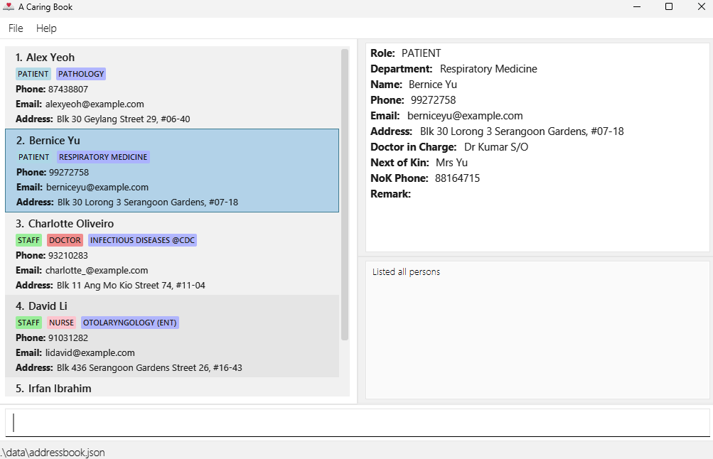
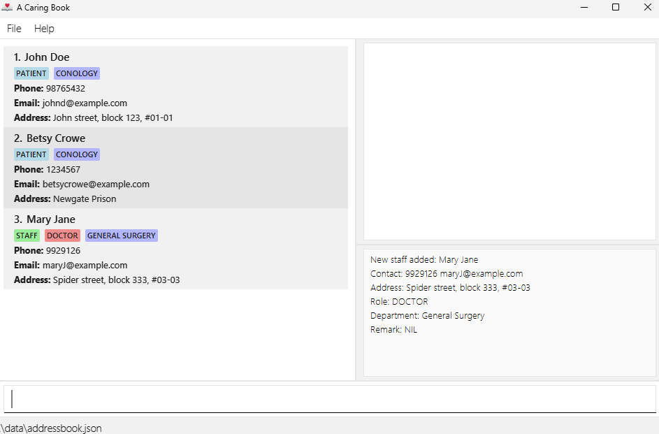
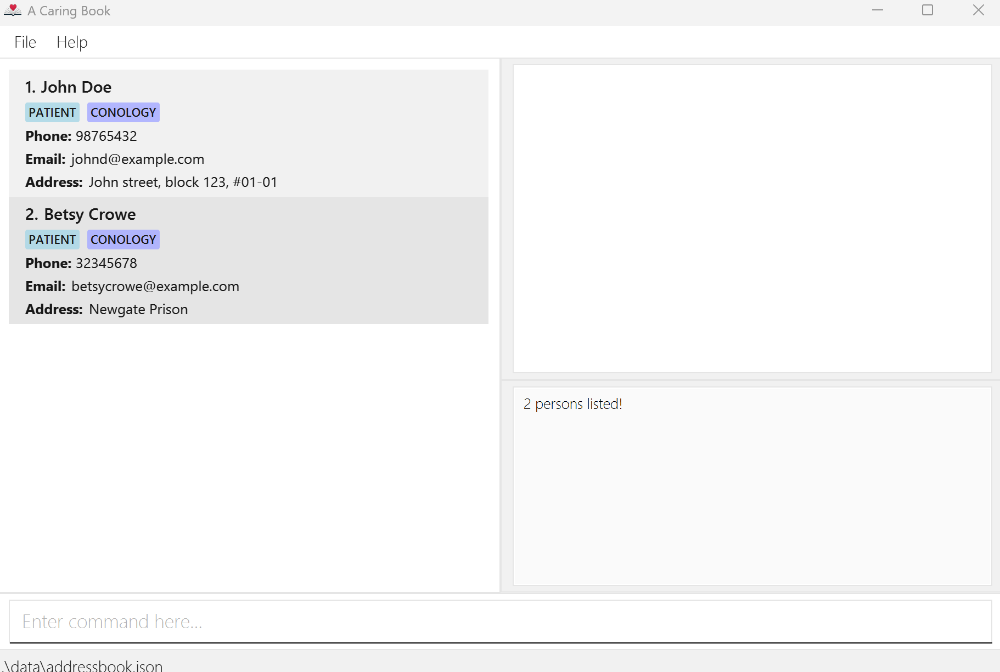
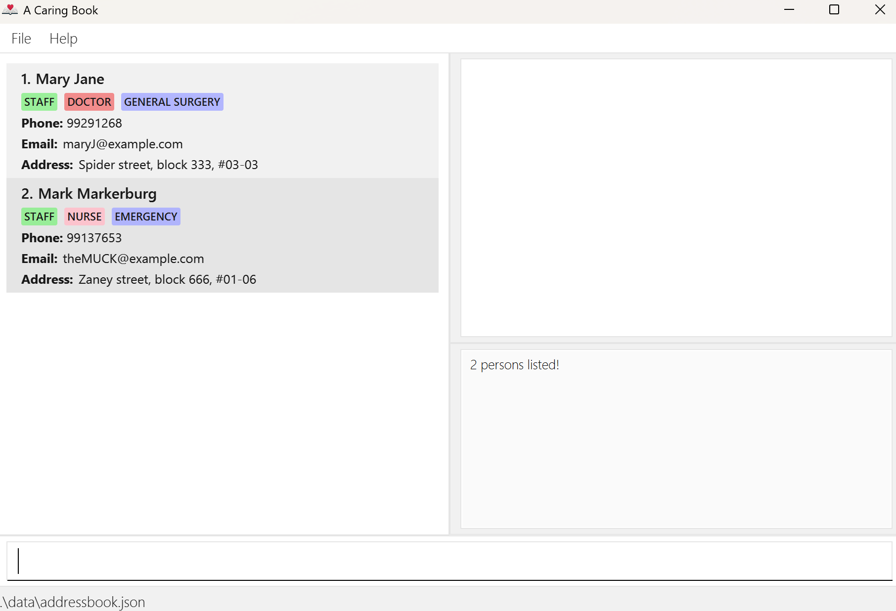

A Caring Book is a **desktop app designed for Patient Care Coordinators to manage patient and staff contact details efficiently**.
Optimized for use via a Command Line Interface (CLI) while retaining the benefits of a Graphical User Interface (GUI),
A Caring Book enables faster contact management compared to traditional GUI apps, especially for users who type quickly.

Unlike conventional systems that require manual entering of details for each category (e.g. Name, Phone, Department),
A Caring Book streamlines the process with `addpatient` and `addstaff` commands. Filtering commands such as
`find`, `findstaff` and `finddep` allow for quick lookup, particularly in emergency situations, making contact management more efficient.
A Caring Book also employs the use of shortcut commands, which further elevates the user experience.

**:warning: Disclaimer**
The current version of ACaringBook is designed to only support the **English language** and for use in **Singapore**.
Using it with other languages or other countries may lead to unexpected behaviour.

* Table of Content
{:toc}

--------------------------------------------------------------------------------------------------------------------

## Quick start
### Installing A Caring Book
1. Ensure you have Java `17` or above installed in your Computer. 
   To check your local Java version, open a command terminal, type `java --version` and press Enter. 
   **Mac users:** Ensure you have the precise JDK version prescribed [here](https://se-education.org/guides/tutorials/javaInstallationMac.html).

1. Download the latest `acaringbook.jar` file from [here](https://github.com/AY2425S2-CS2103T-T12-2/tp/releases/).

1. Move the `acaringbook.jar` file to the folder you want to use as the _home folder_ for your A Caring Book app.

1. Open a command terminal:
 * Windows: Press `Win + R`, type cmd, and press Enter
 * Mac: Press `Cmd + Space`, type Terminal and press Enter
 * Linux: Press `Ctrl + Alt + T`  

1. `cd` into the folder you placed the jar file in, and use the `java -jar acaringbook.jar` command to run the application. 
   
    A GUI similar to the below should appear in a few seconds. 
    

    :blue_book: **Note how the app contains some sample data.** 
    

   
    

1. You can toggle between Light and Dark mode by clicking on "File" in the top left corner of the app window, and select
or deselect the option "Dark Mode". Alternatively, type `tt` and press Enter to toggle between modes.

1. Type the command in the command box and press Enter to execute it. e.g. typing **`help`** and pressing Enter will open the help window. 
   Some example commands you can try:

   * `liststaff` : Lists all staffs.

   * `listpatient` : Lists all patients.

   * `list` : Lists all contacts.

   * `addstaff r/doctor n/Mary Jane p/99291268 e/maryJ@example.com a/Spider street, block 333, #03-03` : Adds a doctor named `Mary Jane` to the Address Book.

   * `addpatient n/John Doe p/98765432 e/johnd@example.com a/John street, block 123, #01-01 dr/Dr Mak nn/Mrs Doe dp/Conology` : Adds a patient named `John Doe` to the Address Book.

   * `remark 3 rm/Needs wheelchair` : Remarks that the 3rd contact shown in the current list needs a wheelchair.

   * `delete 3` : Deletes the 3rd contact shown in the current list.

   * `select 3` : Displays the details of the 3rd contact shown in the current list.

   * `toggletheme` : Toggles between light and dark mode.

   * `clear` : Deletes all contacts.

   * `exit` : Exits the app.

Refer to the [Features](#features) below for details of each command.

--------------------------------------------------------------------------------------------------------------------

## Features

:blue_book: **Notes about the command format:** 

* Words in `UPPER_CASE` are the parameters to be supplied by you. 
  e.g. in `addpatient n/NAME`, `NAME` is a parameter which can be used as `addpatient n/John Doe`.

* Items in square brackets are optional. 
  e.g `n/NAME [e/EMAIL]` can be used as `n/John Doe e/JohnDoe@gmail.com` or as `n/John Doe`.

* Parameters can be in any order. 
  e.g. if the command specifies `n/NAME p/PHONE`, `p/PHONE n/NAME` is also acceptable.

* Extraneous parameters for commands that do not take in parameters (such as `help`, `list`, `exit` and `clear`) will be ignored. 
  e.g. if the command specifies `help 123`, it will be interpreted as `help`.

**Phone Number Constraints:** 

* A Singapore local phone number is required with exactly 8 digits.

* It must start with 3, 6, 8, or 9.

**Email Address Constraints:** 

* Email address must either follow the format `local-part@domain` with these rules:

1. Local Part:
   * Can contain alphanumeric characters and special characters (excluding parentheses):
   `!#$%&'*+/=?^_{|}~-`
   * Cannot start with a special character.

2. Domain:
   * Must contain domain labels separated by periods `(.)`.
   * Each domain label must:
     * Start and end with alphanumeric characters.
     * Consist only of alphanumeric characters or hyphens `(-)`.
   * The final domain label must be at least 2 characters long.

 :exclamation: **Warning:**
If you are using a PDF version of this document, be careful when copying and pasting commands that span multiple lines as space characters surrounding line-breaks may be omitted when copied over to the application.

### Viewing help : `help`

:information_source: **Information:**  This command ignores any additional parameters received

Shows a full list of available commands including shortcuts, descriptions and example usages.

**Format**: `help`

**Shortcut command**: `h`

**Expected output**:

### Adding a patient: `addpatient`

Adds a patient to the address book.

**Format**: `addpatient n/NAME p/PHONE [e/EMAIL] [a/ADDRESS] [dr/DOCTOR_IN_CHARGE] [nn/NOK_NAME] [np/NOK_PHONE] [dp/DEPARTMENT]​`

**Shortcut command**: `ap`

**Examples**:

* `addpatient n/John Doe p/98765432 e/johnd@example.com a/John street, block 123, #01-01 dr/Dr Mak nn/Mrs Hong Doe np/98721322 dp/Conology`
* `addpatient n/Betsy Crowe e/betsycrowe@example.com a/Newgate Prison p/32345678 dr/Dr Teo nn/Mr Bui Crowe np/98268642 dp/Conology`

**Expected output**:

Upon successful addition, the details for the `Patient` will be shown like so

 

 
:exclamation: **Warning:** If you encounter the warning message "Invalid command format!" and your input on the command line turns red, you should check your input against the format and example provided on the right side of the screen.

### Adding a staff: `addstaff`

Adds a staff to the address book.

**Format**: `addstaff [r/ROLE] n/NAME p/PHONE [dp/DEPARTMENT] [e/EMAIL] [a/ADDRESS]​`

**Shortcut command**: `as`

**Examples**:
* `addstaff r/doctor n/Mary Jane dp/General Surgery p/99291268 e/maryJ@example.com a/Spider street, block 333, #03-03`
* `addstaff r/nurse n/Mark Markerburg dp/Emergency p/99137653 e/theMUCK@example.com a/Zaney street, block 666, #01-06`

**Expected output**:

Upon successful addition, the details for the `HealthcareStaff` will be shown like so

 

 
:exclamation: **Warning:** If you encounter the warning message "Invalid command format!" and your input on the command line turns red, you should check your input against the format and example provided on the right side of the screen.

### Editing a person : `edit`

Edits an existing person in the address book.

**Format**: `edit INDEX [r/role] [n/NAME] [p/PHONE] [e/EMAIL] [a/ADDRESS] [dr/DOCTOR_IN_CHARGE] [nn/NOK_NAME] [np/NOK_PHONE] [dp/DEPARTMENT]`

**Shortcut command**: `e`

* Edits the person at the specified `INDEX`. The index refers to the index number shown in the displayed person list. The index **must be a positive integer** 1, 2, 3, …​
* At least one of the optional fields must be provided.
* Existing values will be updated to the input values.
* Role field is only available for healthcare staff, doctor_in_charge, nok_name, nok_phone and department fields are only available for patients.
* A patient's nok_phone cannot be the same as a patient's phone number.

**Examples**:
*  `edit 1 p/91234567 e/johndoe@example.com` Edits the phone number and email address of the 1st person to be `91234567` and `johndoe@example.com` respectively.

**Expected output**:

Upon successful addition, the details for the edited `Person` will be shown like so

 

 
:exclamation: **Warning:** If you encounter the warning message "Invalid command format!" and your input on the command line turns red, you should check your input against the format and example provided on the right side of the screen.

### Adding remark to a person : `remark`

Adds or updates the remark of the specified person from the address book.

**Format**: `remark INDEX rm/REMARK`

**Shortcut command**: `re`

* Adds or updates the remark of the person at the specified `INDEX`.
* The index refers to the index number shown in the displayed person list.
* The index **must be a positive integer** 1, 2, 3, …​

**Examples**:
* `list` followed by `remark 2 rm/Needs wheelchair` updates the 2nd person in the address book.
* `find Betsy` followed by `remark 1 rm/Banana allergy` updates the 1st person in the results of the `find` command.
* `remark 3 rm/` clears the remark for the 3rd person.

**Expected output**:

Remark field will be updated immediately and details of the Person will be shown on the right side of the screen.
 

 
:exclamation: **Warning:** If you encounter the warning message "Invalid command format!" and your input on the command line turns red, you should check your input against the format and example provided on the right side of the screen.

### Deleting a person : `delete`

Deletes the specified person from the address book.

**Format**: `delete INDEX`

**Shortcut command**: `del` or `d`

* Deletes the person at the specified `INDEX`.
* The index refers to the index number shown in the displayed person list.
* The index **must be a positive integer** 1, 2, 3, …​

**Examples**:
* `list` followed by `delete 2` deletes the 2nd person in the address book.
* `find Betsy` followed by `delete 1` deletes the 1st person in the results of the `find` command.

**Expected output**:

The details of the deleted Person will be shown on the right side of the screen.
 

 
:exclamation: **Warning:** This action is **IRREVERSIBLE**. You cannot retrieve deleted "Person" data.

### Select a contact to view details : `select`

Selects a `Patient` or `HealthcareStaff` to view the details on the right side of the screen.

**Format**: `select INDEX`

**Shortcut command**: `s`

**Example**: `select 4` shows the details of the contact whose index is 4 in the list.

### Listing all persons : `list`

:information_source: **Information:**  This command ignores any additional parameters received

Shows a list of all persons in the address book.

**Format**: `list`

**Shortcut command**: `ls`

**Expected output**: Listed all persons

### Listing all patients : `listpatient`

:information_source: **Information:**  This command ignores any additional parameters received

Shows a list of all patients in the address book.

**Format**: `listpatient`

**Shortcut command**: `lsp`

**Expected output**: Listed all patients

### Listing all staffs : `liststaff`

:information_source: **Information:**  This command ignores any additional parameters received

Shows a list of all staff in the address book.

**Format**: `liststaff`

**Shortcut command**: `lss`

**Expected output**: Listed all staff

### Locating person by name: `find`

Finds a list of `Person` (which can be `Patient` or `HealthcareStaff`) whose names contain any of the given keywords.

**Format**: `find KEYWORD [MORE_KEYWORDS]`

**Shortcut command**: `f`

* The search is case-insensitive. e.g `hans` will match `Hans`
* The order of the keywords does not matter. e.g. `Hans Bo` will match `Bo Hans`
* Only the name is searched.
* Partial words will be matched e.g. `Han` will match `Hans`
* Persons matching at least one keyword will be returned (i.e. `OR` search).
  e.g. `Hans Bo` will return `Hans Gruber`, `Bo Yang`

**Examples and expected outputs**:
* `find John` returns `john` and `John Doe`
* `find alex charlotte` returns `Alex Yeoh`, `Charlotte Oliveiro` 
  
 

 
:exclamation: **Warning:** If you encounter the warning message "Invalid command format!" and your input on the command line turns red, you should check your input against the format and example provided on the right side of the screen.

### Locating a contact by department: `finddep`

Finds a list of `Person` (including both `Patient` and `HealthcareStaff`) whose departments match with the keyword.

**Format**: `finddep KEYWORD [MORE_KEYWORDS]`

**Shortcut command**: `fd`

* The search is case-insensitive. e.g `Conology` will match `conology`
* Only the department of the contact is searched.
* Partial words will be matched e.g. `con` will match `conology`.
* All contacts in the department will be returned e.g. `finddep conology` will return a list of Conology patients and doctors.

**Examples and expected outputs**:

If these two commands are executed,
* `addpatient n/John Doe p/98765432 e/johnd@example.com a/John street, block 123, #01-01 dr/Dr Mak nn/Mrs Hong Doe np/98721322 dp/Conology`
* `addpatient n/Betsy Crowe e/betsycrowe@example.com a/Newgate Prison p/32345678 dr/Dr Teo nn/Mr Bui Crowe np/98268642 dp/Conology`

then
* `finddep conology` returns `John Doe` and `Betsy Crowe`.

 

 
:exclamation: **Warning:** If you encounter the warning message "Invalid command format!" and your input on the command line turns red, you should check your input against the format and example provided on the right side of the screen.

### Locating a healthcare provider by role: `findstaff`

Find a list of `HealthcareStaff` whose roles matches with the keyword.

**Format**: `findstaff KEYWORD [MORE_KEYWORDS]`

**Shortcut command**: `fs`

* The search is case-insensitive. e.g `Doctor` will match `doctor`
* Only the role of the healthcare provider is searched.
* Partial words will be matched e.g. `doc` will match `doctor`.
* All healthcare staff matching the role will be returned e.g. `findstaff doctor` will return a list of all doctors.

**Examples and expected outputs**:

If these two `addstaff` commands are executed,
* `addstaff r/doctor n/Mary Jane dp/General Surgery p/99291268 e/maryJ@example.com a/Spider street, block 333, #03-03`
* `addstaff r/nurse n/Mark Markerburg dp/Emergency p/99137653 e/theMUCK@example.com a/Zaney street, block 666, #01-06`

then
* `findstaff doctor` returns `Mary Jane`
* `findstaff nurse` returns `Mark Markerburg`
* `fs doctor nurse` returns `Mary Jane` and `Mark Markerburg`.

 
:exclamation: **Warning:** If you encounter the warning message "Invalid command format!" and your input on the command line turns red, you should check your input against the format and example provided on the right side of the screen.

### Toggle between light and dark mode : `toggletheme`

:information_source: **Information:**  This command ignores any additional parameters received

Toggles between light and dark mode theme based on user preference.

**Format**: `toggletheme`

**Shortcut command**: `tt`

### Clearing all entries : `clear`

:information_source: **Information:**  This command ignores any additional parameters received

Clears all entries from the address book.

**Format**: `clear`

**Shortcut command**: `cls`

**Expected output**: The entire address book will be cleared.
 

 
:exclamation: **Warning:** This action is **IRREVERSIBLE**. You cannot retrieve deleted "Person" data.

### Exiting the program : `exit`

:information_source: **Information:**  This command ignores any additional parameters received

Exits the program.

**Format**: `exit`

**Alternative command**: `quit`

### Saving the data

A Caring Book data are saved automatically after any command that changes the data. There is no need to save manually.

### Editing the data file

A Caring Book data are saved automatically as a JSON file `[JAR file location]/data/addressbook.json`. Advanced users are welcome to update data directly by editing that data file.

:exclamation: **Caution**  
If your changes to the data file makes its format invalid, A Caring Book will discard all data and start with an empty data file at the next run. Hence, it is recommended to take a backup of the file before editing it.  
Furthermore, certain edits can cause A Caring Book to behave in unexpected ways (e.g., if a value entered is outside of the acceptable range). Therefore, edit the data file only if you are confident that you can update it correctly.

--------------------------------------------------------------------------------------------------------------------

## FAQ

**Q**: How do I transfer my data to another computer? 
**A**: First, install A Caring Book on the new computer by following the steps in the Quick Start guide. Once installed, locate the newly created data file (addressbook.json) in the app's home folder.
Next, copy the addressbook.json file from your previous computer and paste it into the same location on the new computer. When prompted, confirm that you want to replace the existing file. This will transfer your data successfully.

--------------------------------------------------------------------------------------------------------------------

## Known issues

1. **When using multiple screens**, if you move the application to a secondary screen, and later switch to using only the primary screen, the GUI will open off-screen. The remedy is to delete the `preferences.json` file created by the application before running the application again.
2. **If you minimize the Help Window** and then run the `help` command (or use the `Help` menu, or the keyboard shortcut `F1`) again, the original Help Window will remain minimized, and no new Help Window will appear. The remedy is to manually restore the minimized Help Window.
3. **Execute other commands after `find`, `findstaff`, `finddp`, `listpatient` or `liststaff` command** could reset the filter and full contact list will be shown.
4. **Deleting selected contact (via `select` command)** sets the content panel on the top right to be the previous contact.

--------------------------------------------------------------------------------------------------------------------

## Command summary

| Action                      | Shortcut command | Format, Examples                                                                                                                                                                                                                                         |
|-----------------------------|------------------|----------------------------------------------------------------------------------------------------------------------------------------------------------------------------------------------------------------------------------------------------------|
| **Add Patient**             | `ap`             | `addpatient n/NAME p/PHONE [e/EMAIL] [a/ADDRESS] [dr/DOCTOR_IN_CHARGE] [nn/NOK_NAME] [np/NOK_PHONE] dp/DEPARTMENT]​`    e.g., `addpatient n/James Ho p/22224444 e/jamesho@example.com a/123, Clementi Rd, 1234665 dr/Dr Mak nn/Mrs Ho dp/Conology` |
| **Add Staff**               | `as`             | `addstaff [r/ROLE] n/NAME [dp/DEPARTMENT] p/PHONE [e/EMAIL] [a/ADDRESS]​`    e.g., `addstaff r/doctor n/James Ho dp/Internal Medicine p/22224444 e/jamesho@example.com a/123, Clementi Rd, 1234665`                                                |
| **Clear**                   | `cls`            | `clear`                                                                                                                                                                                                                                                  |
| **Delete**                  | `del`, `d`       | `delete INDEX`   e.g., `delete 3`                                                                                                                                                                                                                  |
| **Edit**                    | `e`              | `edit INDEX [r/ROLE] [n/NAME] [p/PHONE] [e/EMAIL] [a/ADDRESS] [dr/DOCTOR_IN_CHARGE] [nn/NOK_NAME] [np/NOK_PHONE] [dp/DEPARTMENT]​`   e.g.,`edit 2 n/James Lee e/jameslee@example.com`                                                              |
| **Exit**                    | none             | `exit` or `quit`                                                                                                                                                                                                                                         |
| **Find By Name**            | `f`              | `find KEYWORD [MORE_KEYWORDS]`   e.g., `find James Jake`                                                                                                                                                                                           |
| **Find By Department**      | `fd`             | `finddep KEYWORD`   e.g., `finddep surgery`                                                                                                                                                                                                        |
| **Find Staff By Role**      | `fs`             | `findstaff KEYWORD`   e.g., `findstaff nurse`                                                                                                                                                                                                      |
| **List**                    | `ls`             | `list`                                                                                                                                                                                                                                                   |
| **List Patient**            | `lsp`            | `listpatient`                                                                                                                                                                                                                                            |
| **List Staff**              | `lss`            | `liststaff`                                                                                                                                                                                                                                              |
| **Help**                    | `h`              | `help`                                                                                                                                                                                                                                                   |
| **Remark**                  | `re`             | `remark INDEX rm/REMARK`    e.g. `remark 1 rm/Banana allergy`                                                                                                                                                                                      |
| **Select**                  | `s`              | `select INDEX`    e.g. `select 2`                                                                                                                                                                                                                  |
| **Toggle light/dark theme** | `tt`             | `toggletheme`                                                                                                                                                                                                                                            |

--------------------------------------------------------------------------------------------------------------------

## Parameter constraints

**Name Constraints `n/`:**
* Name must be 1 to 66 characters long, contain at least one letter (A-Z, a-z). 
* It must start and end with an alphanumeric character (A-Z, a-z, 0-9). 
* It may contain spaces and the following special characters in between: `, ( ) / . @ - '`

**Phone Number Constraints `p/`:**
* A Singapore local phone number is required with exactly 8 digits.
* It must start with 3, 6, 8, or 9.
* It may be `NA` if not available.

**Email Address Constraints `e/`:**
* Email address must either be `NA` if not available or follow the format `local-part@domain-label.domain-label` with these rules:

1. Local Part:
    * Can contain alphanumeric characters and special characters (excluding parentheses):`(+_.)`
    * Cannot start with a special character.

2. Domain:
    * Must contain domain labels separated by periods `(.)`.
    * Each domain label must:
        * Start and end with alphanumeric characters.
        * Consist only of alphanumeric characters separated only by hyphens `(-)` if any.
    * The final domain label must be at least 2 characters long.

**Healthcare Staff ProviderRole Constraints `r/`:**
* Healthcare staff provider-role must either be `NA` if not available or one of the following: 
  * `doctor`
  * `nurse`
  * `therapist`

**Department Constraints `dp/`:**
* Department name must be 1 to 50 characters contain only letters, digits, spaces, or the following special characters: `-_,.()/&@.`.

--------------------------------------------------------------------------------------------------------------------
## Glossary

- **Command**: An instruction typed into the command box to perform an action, such as `addpatient` or `delete`.
- **Command Box**: The input area at the bottom of the GUI where users type commands.
- **Command Format**: The expected structure of a command, showing required and optional fields using prefixes.
- **Displayed Person List**: The current list of persons shown in the GUI after using commands like `list`, `find`, or `liststaff`.
- **Error Message**: Text shown when something is wrong with the input or when the command cannot be executed. Usually helps guide the user to correct the mistake.
- - **Parameter**: Information that you are required to provide to the command.
- **Field**: A section of a contact’s details. Examples include name, phone, address, remark, and email.
- **Help Window**: A pop-up window showing a full list of commands, shortcuts, and usage instructions.
- **Index**: A number that identifies a person in the current list view. Used in commands like `delete 2` to refer to the 2nd person shown.
- **Input**: The text entered by the user into the command box.
- **JSON File**: The file (`addressbook.json`) where all contacts are stored. Located in the `/data` folder and automatically updated after each command.
- **Output**: The result displayed after entering a command. This includes success messages, error messages, or updated contact details in the GUI.
- **Prefix**: A short label used to indicate a specific field in a command. For example, `n/` is the prefix for name, `p/` for phone.
- **Remark**: A short note attached to a person, updated using the `remark` command, e.g., `remark 2 rm/Needs wheelchair`.
- **Shortcut Command**: A shortened alias for a full command. For example, `ap` is the shortcut for `addpatient`.
- **Command Line Interface (CLI)**: A Command Line Interface allows users to interact with an application by typing commands to execute actions.
- **Graphical User Interface (GUI)**: A Graphical User Interface allows users to interact with an application through graphics like buttons or icons.
- **Alphanumeric**: Characters that are either numbers or letters.
